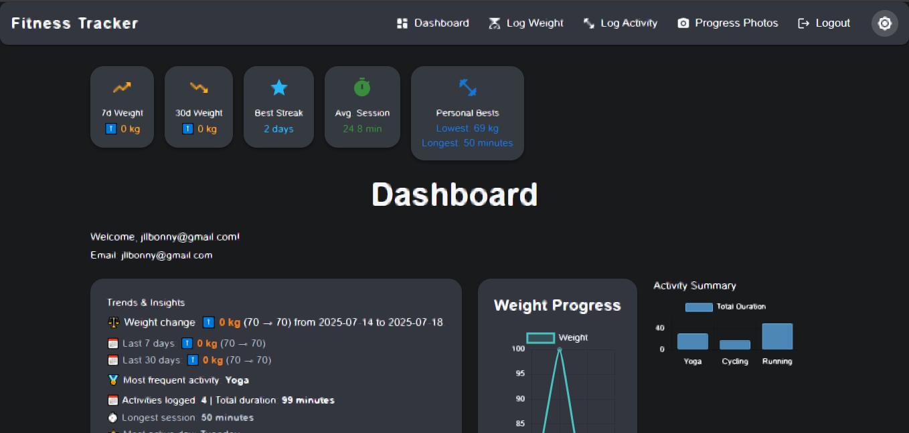
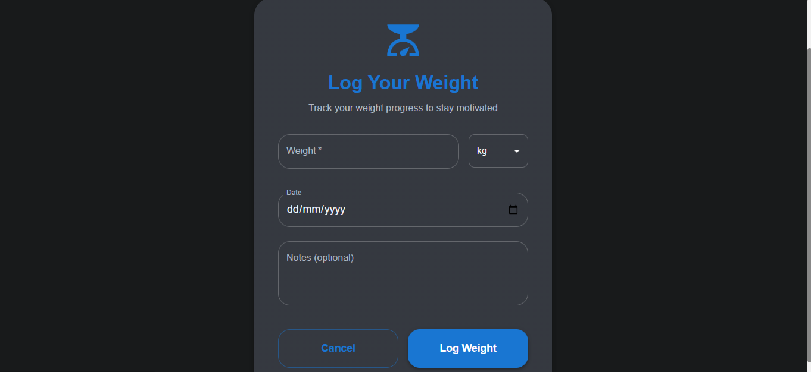
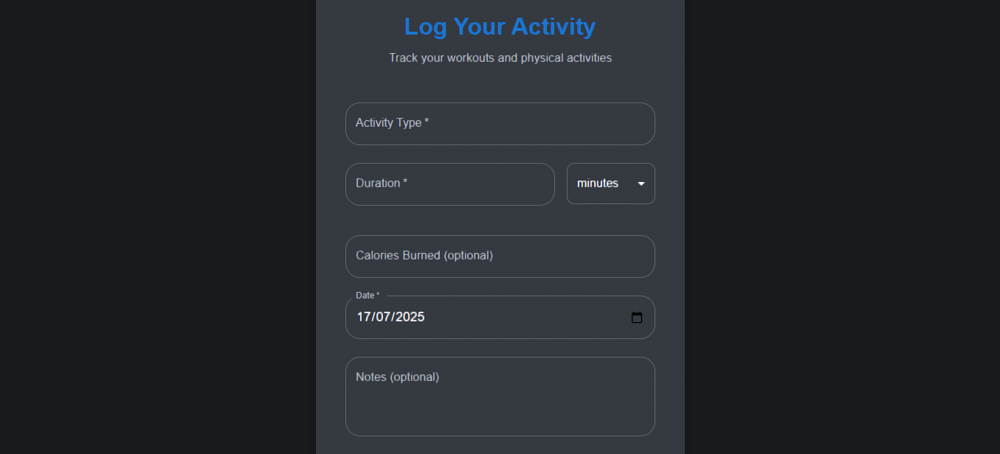
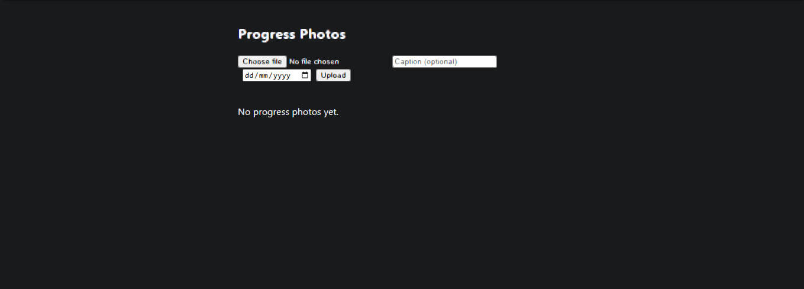
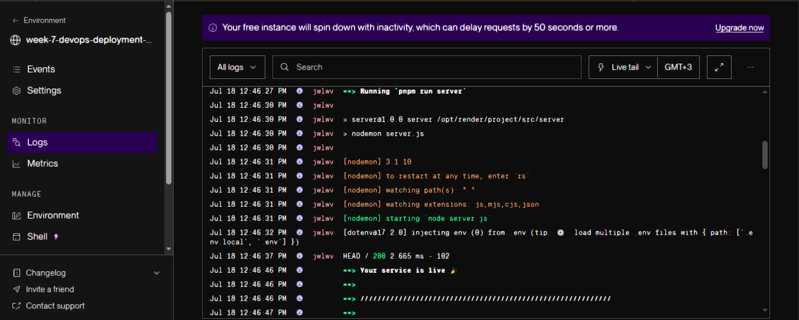
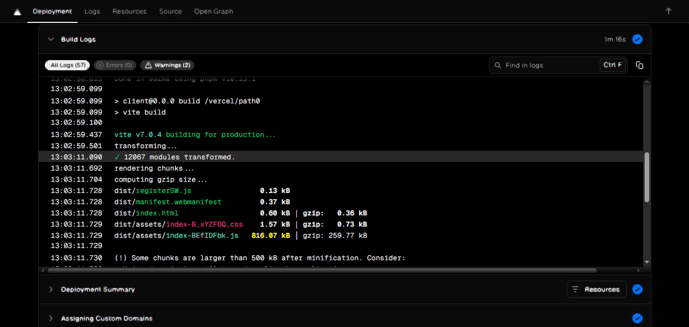
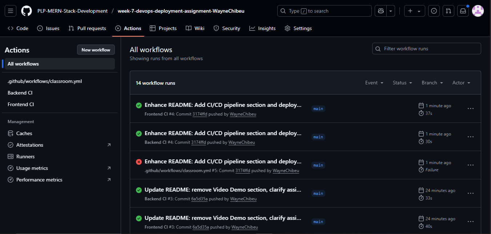

# Fitness Tracker – MERN Stack Assignment (Week 7)

## Table of Contents
- [Project Overview](#project-overview)
- [Key Features](#key-features)
- [Architecture & Design](#architecture--design)
- [Tech Stack](#tech-stack)
- [Screenshots](#screenshots)
- [Live Demo](#live-demo)
- [Getting Started](#getting-started)
  - [Prerequisites](#prerequisites)
  - [Installation](#installation)
  - [Environment Variables](#environment-variables)
  - [Running the App](#running-the-app)
- [API Documentation](#api-documentation)
- [Project Structure](#project-structure)
- [Testing & Quality](#testing--quality)
- [Deployment](#deployment)
- [Security Considerations](#security-considerations)
- [Developer Notes](#developer-notes)
- [Contributing](#contributing)
- [License](#license)
- [Acknowledgements](#acknowledgements)

---

## Project Overview

**Fitness Tracker** is a comprehensive full-stack MERN application designed to empower users to take control of their health journey. Users can log and visualize their weight, track physical activities, set and monitor goals, and gain insights through interactive charts and analytics. The project demonstrates advanced skills in database design, RESTful API development, authentication, data visualization, and modern React UI/UX.

---

## Key Features
- **User Authentication:** Secure registration, login, and JWT-based session management.
- **Weight Tracking:** Log, view, and edit weight entries with units, notes, and timestamps.
- **Activity Logging:** Record physical activities (type, duration, calories, notes) and view history.
- **Goal Setting:** Set and track weight goals, with visual progress indicators.
- **Progress Photos:** Upload and manage progress photos to visually track transformation.
- **Dashboard & Analytics:**
  - Weight trends (line chart)
  - Activity breakdown (bar/pie chart)
  - Calories burned over time
  - Goal progress visualization
- **Responsive UI:** Modern, mobile-friendly design with dark mode support.
- **Protected Routes:** Only authenticated users can access sensitive features.
- **Validation & Error Handling:** Robust form validation and user-friendly error messages.
- **Motivational Features:** Random motivational quotes and encouragement.
- **Export Data:** Download weight and activity logs as CSV for personal records.
- **Comprehensive Testing:** Backend and frontend tests for reliability.

---

## Architecture & Design

- **Frontend:**
  - Built with React (Vite), Material UI, Chart.js for data visualization, and Axios for API calls.
  - Uses React Router for navigation and protected routes for security.
  - State management is handled via React hooks and context where appropriate.
  - Responsive design ensures usability on all devices.

- **Backend:**
  - Node.js with Express.js REST API.
  - MongoDB with Mongoose for data modeling.
  - JWT for authentication, bcryptjs for password hashing.
  - Express middleware for validation, security (helmet, CORS), and rate limiting.
  - Logging with Winston and request logging with Morgan.

- **Security:**
  - Rate limiting on all routes and stricter limits on authentication endpoints.
  - Helmet for HTTP header security.
  - CORS configured for safe cross-origin requests.
  - Input validation and sanitization on all endpoints.
  - Passwords hashed and never stored in plain text.

- **Testing:**
  - Backend: Jest and Supertest for API and logic tests.
  - Frontend: Vitest and React Testing Library (with setup for further expansion).

---

## Tech Stack
- **Frontend:** React, Vite, Material UI, Chart.js, Axios, React Router
- **Backend:** Node.js, Express.js, MongoDB, Mongoose, JWT, bcryptjs, dotenv
- **Testing:** Jest, Supertest (backend), Vitest (frontend)
- **Deployment:** Vercel (frontend), Render (backend), MongoDB Atlas

---

## Screenshots

### Dashboard


### Log Weight


### Log Activity


### Progress Photos


---

## Live Demo
[Frontend Live App](https://client-xi-ochre-21.vercel.app)

[Backend API](https://week-7-devops-deployment-assignment-dxo6.onrender.com)

---

## Getting Started

### Prerequisites
- Node.js (v18 or higher)
- MongoDB (local or Atlas)
- pnpm, npm, or yarn
- Git

### Installation
1. Clone the repository:
   ```bash
   git clone <your-repo-url>
   cd week-7-devops-deployment-assignment-WayneChibeu
   ```
2. Install dependencies for both client and server:
   ```bash
   cd server && pnpm install
   cd ../client && pnpm install
   ```

### Environment Variables
Create `.env` files in both `server/` and `client/` directories. See `.env.example` in each folder for required variables.

**server/.env.example**
```
MONGODB_URI=your_mongodb_uri_here
JWT_SECRET=your_jwt_secret_here
PORT=5000
```
**client/.env.example**
```
VITE_API_URL=http://localhost:5000
```

### Running the App
- **Start the backend:**
  ```bash
  cd server
  pnpm run server
  # or npm run server
  ```
- **Start the frontend:**
  ```bash
  cd client
  pnpm run dev
  # or npm run dev
  ```
- Visit [http://localhost:5173](http://localhost:5173) in your browser.

---

## API Documentation

### Authentication
- `POST /api/auth/register` – Register a new user
- `POST /api/auth/login` – Login and receive JWT
- `GET /api/auth/me` – Get current user info (requires JWT)
- `POST /api/auth/forgot-password` – Request password reset
- `POST /api/auth/reset-password` – Reset password with token

### Weights
- `POST /api/weights` – Add a new weight entry (auth required)
- `GET /api/weights` – Get all weight entries for user (auth required)
- `PUT /api/weights/:id` – Update a weight entry (auth required)
- `DELETE /api/weights/:id` – Delete a weight entry (auth required)
- `GET /api/weights/export` – Export weights as CSV (auth required)

#### Weight Model
```js
{
  userId: ObjectId, // reference to User
  weight: Number,   // required
  unit: 'kg' | 'lbs',
  date: Date,
  notes: String
}
```

### Activities
- `POST /api/activities` – Add a new activity entry (auth required)
- `GET /api/activities` – Get all activity entries for user (auth required)
- `PUT /api/activities/:id` – Update an activity entry (auth required)
- `DELETE /api/activities/:id` – Delete an activity entry (auth required)
- `GET /api/activities/export` – Export activities as CSV (auth required)

#### Activity Model
```js
{
  userId: ObjectId, // reference to User
  type: String,     // required
  duration: Number, // required
  unit: 'minutes' | 'hours',
  caloriesBurned: Number,
  date: Date,
  notes: String
}
```

### Progress Photos
- `POST /api/progress-photos` – Upload a new progress photo (auth required)
- `GET /api/progress-photos` – List all progress photos (auth required)
- `GET /api/progress-photos/:id` – Get a specific progress photo (auth required)
- `DELETE /api/progress-photos/:id` – Delete a progress photo (auth required)

### User Model
```js
{
  email: String,    // required, unique
  password: String, // hashed
  firstName: String,
  lastName: String
}
```

---

## Project Structure
```
week-7-devops-deployment-assignment-WayneChibeu/
  client/         # React frontend
    src/
      components/
      ...
    public/
    ...
  server/         # Express backend
    controllers/
    models/
    routes/
    ...
  README.md
  .gitignore
  ...
```

---

## Testing & Quality

- **Backend:**
  - Uses **Jest** and Supertest for unit and integration tests.
  - Run tests with `pnpm test` or `npm test` in the `server/` directory.
- **Frontend:**
  - Uses **Vitest** and React Testing Library for component and integration tests.
  - Run tests with `pnpm test` or `npm test` in the `client/` directory.
- **Linting:**
  - ESLint is configured for both backend and frontend.
  - Run `pnpm lint` in each directory to check code quality.

---

## Deployment
- **Frontend:** Deployed on Vercel ([Frontend Live App](https://client-xi-ochre-21.vercel.app))
- **Backend:** Deployed on Render ([Backend API](https://week-7-devops-deployment-assignment-dxo6.onrender.com))
- **Database:** MongoDB Atlas
- Set environment variables in your deployment platform

---

## CI/CD Pipeline

The backend is automatically deployed to Render on every push to the main branch. Below is a screenshot of a successful deployment:



The frontend is automatically deployed to Vercel on every push to the main branch. Below is a screenshot of a successful Vercel deployment:



GitHub Actions is used for CI/CD automation. Below is a screenshot of a successful workflow run:



Sample Render deployment log:
```
2025-07-18T09:46:46.936305541Z ==> Your service is live 🎉
2025-07-18T09:46:47.047072493Z ==> Available at your primary URL https://week-7-devops-deployment-assignment-dxo6.onrender.com
...
```

Sample Vercel build log:
```
- Adjust chunk size limit for this warning via build.chunkSizeWarningLimit.
✓ built in 12.26s
PWA v1.0.1
mode      generateSW
precache  7 entries (799.19 KiB)
files generated
  dist/sw.js
  dist/workbox-3e8df8c8.js
Build Completed in /vercel/output [17s]
Deploying outputs...
Deployment completed
Uploading build cache [51.58 MB]...
Build cache uploaded: 623.913ms
Exiting build container
```

---

## Security Considerations
- **Rate Limiting:** Prevents brute-force and abuse (global and auth-specific limits).
- **Helmet:** Secures HTTP headers.
- **CORS:** Restricts cross-origin requests to trusted domains.
- **Input Validation:** All user input is validated and sanitized.
- **Password Hashing:** User passwords are hashed with bcryptjs.
- **JWT Authentication:** Secure, stateless session management.
- **Error Handling:** No sensitive error details are leaked in production.

---

## Developer Notes
- **Extensible:** The codebase is modular and easy to extend (add new features, endpoints, or UI components).
- **Environment Config:** Use `.env` files for secrets and environment-specific settings.
- **Testing:** Add more frontend tests as needed for new features.
- **Contributions:** PRs and suggestions are welcome!

---

## Contributing
Pull requests are welcome! For major changes, please open an issue first to discuss what you would like to change.

---

## License
[MIT](LICENSE)

---

## Acknowledgements
- [MongoDB Documentation](https://docs.mongodb.com/)
- [Express.js Documentation](https://expressjs.com/)
- [React Documentation](https://react.dev/)
- [Node.js Documentation](https://nodejs.org/en/docs/)
- [Chart.js](https://www.chartjs.org/)
- [Material UI](https://mui.com/)
- [GitHub Classroom Guide](https://docs.github.com/en/education/manage-coursework-with-github-classroom) 

---

**For more details, see the assignment instructions in `Week7-Assignment.md`.** 
